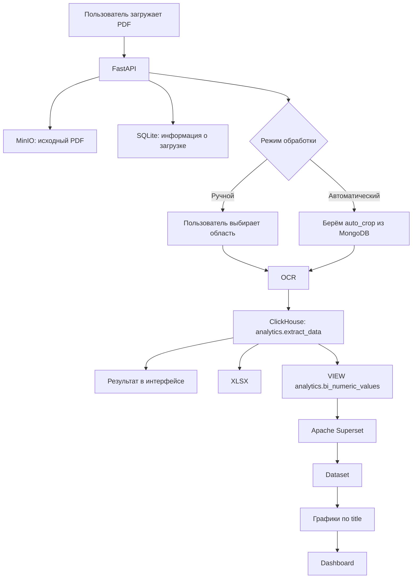
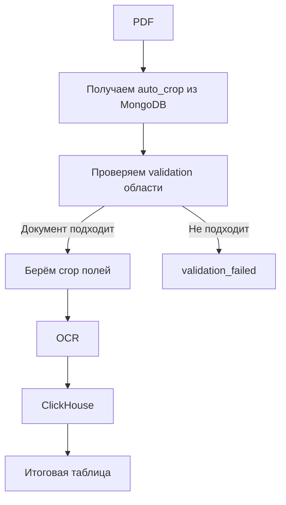
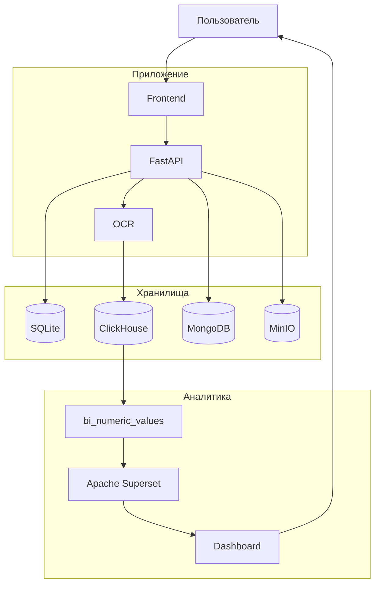

# Система обработки документов

Проект представляет собой сервис для загрузки PDF-документов, распознавания нужных полей и дальнейшей работы с полученными данными.

Документ можно обработать вручную или автоматически. После обработки значения сохраняются в ClickHouse, сами файлы хранятся в MinIO, а служебные данные приложения — в SQLite. Для аналитики используется Apache Superset, который подключается напрямую к ClickHouse.

## Как всё работает



Если коротко:

1. Пользователь выбирает тип документа и загружает PDF.
2. Файл сохраняется в MinIO.
3. Информация о загрузке сохраняется в SQLite.
4. Документ обрабатывается вручную или автоматически.
5. OCR получает значения нужных полей.
6. Результаты записываются в ClickHouse.
7. Из них можно собрать таблицу, скачать XLSX или открыть аналитику в Superset.

## Основные сервисы

Проект запускается через Docker Compose.

Основные контейнеры:

- `app` — FastAPI и frontend;
- `clickhouse` — результаты OCR и аналитические данные;
- `mongodb` — формы документов и настройки `auto_crop`;
- `minio` — файловое хранилище;
- `superset` — BI;
- `superset-db` — внутренний PostgreSQL Superset;
- `superset-redis` — Redis для Superset.

# Хранилища

В проекте используется несколько хранилищ, потому что у разных типов данных разные задачи.

## SQLite

SQLite используется для служебных данных приложения.

Файл базы:

```text
data/sql_app.db
```

Там хранятся данные, связанные с самим процессом обработки:

- типы документов;
- загруженные документы;
- поля документов;
- выбранные области;
- связи между файлами и полями;
- другая служебная информация.

Примерно:

```text
SQLite
├── DocumentType
├── UploadedFile
├── DocumentField
└── Crop
```

Сам PDF в SQLite не хранится.

Если совсем просто, SQLite отвечает за то, **что происходит внутри приложения**.

## ClickHouse

ClickHouse используется для результатов OCR и аналитики.

Основная таблица:

```text
analytics.extract_data
```

```sql
CREATE TABLE analytics.extract_data
(
    id UInt64,

    upload_id String,
    page UInt32,

    crop_id UInt64,
    field_id UInt64,

    document_type String,
    filename String,

    title String,
    ru_title String,
    unit String,
    value_type String,

    raw_value String,
    value String,
    numeric_value Nullable(Float64),

    confidence Nullable(Float64),
    timestamp DateTime
)
ENGINE = MergeTree
ORDER BY (
    upload_id,
    page,
    title,
    timestamp,
    id
);
```

Одна строка здесь — одно извлечённое значение.

Например:

```text
document_type: electricity
title: tariff_kw_day
ru_title: Дневной тариф
numeric_value: 6.42
timestamp: 2026-08-09 12:30:00
```

`title` — техническое имя поля:

```text
tariff_kw_day
tariff_kw_night
all_sum
```

`ru_title` — название для интерфейса:

```text
Дневной тариф
Ночной тариф
Общая сумма
```

`value` хранит строковое значение, а `numeric_value` — числовое, если поле можно представить числом.

Для Superset используется VIEW:

```text
analytics.bi_numeric_values
```

```sql
CREATE VIEW analytics.bi_numeric_values AS
SELECT
    upload_id,
    page,
    document_type,
    filename,
    title,
    ru_title,
    unit,
    value_type,
    value,
    numeric_value,
    confidence,
    timestamp
FROM analytics.extract_data
WHERE numeric_value IS NOT NULL;
```

Это простая витрина с числовыми значениями. Superset читает её напрямую.

То есть здесь нет лишнего переноса:

```text
ClickHouse -> SQLite -> Superset
```

Используется:

```text
ClickHouse -> Superset
```

## MinIO

MinIO используется как файловое хранилище.

В него складываются:

- исходные PDF;
- preview страниц;
- готовые XLSX.

Примерная структура:

```text
documents/
└── <upload_id>/
    └── document.pdf

previews/
└── <upload_id>/
    ├── 0.png
    ├── 1.png
    └── ...

exports/
└── <upload_id>.xlsx
```

### Исходные документы

```text
documents/<upload_id>/<filename>
```

### Preview страниц

```text
previews/<upload_id>/<page>.png
```

Они нужны для ручного режима, чтобы пользователь мог открыть страницу и выделить нужную область.

### XLSX

```text
exports/<upload_id>.xlsx
```

Файлы не зависят от файловой системы контейнера приложения. Контейнер можно пересобрать, а данные останутся в MinIO.

Для объектов также можно задавать автоматическое удаление через lifecycle.

## MongoDB

MongoDB хранит не результаты OCR, а описание того, **как обрабатывать документ**.

Для каждого типа документа там находятся:

- список полей;
- подписи;
- типы;
- единицы измерения;
- обязательность;
- ограничения;
- настройки автоматического crop.

Пример поля:

```javascript
{
  id: "tariff_kw_day",
  label: "Дневной тариф",
  type: "number",
  unit: "₽/кВт·ч",
  required: true
}
```

Пример `auto_crop`:

```javascript
auto_crop: {
  validation: [
    // области для проверки шаблона
  ],

  fields: {
    tariff_kw_day: {
      crop: {
        x: 0.54,
        y: 0.31,
        width: 0.07,
        height: 0.01
      }
    }
  }
}
```

Координаты находятся в диапазоне `0..1`, поэтому они не зависят напрямую от размера изображения.

# Ручная обработка

В ручном режиме пользователь сам выбирает область для каждого поля.

```mermaid
flowchart LR
    A[PDF] --> B[Выбор страницы]
    B --> C[Выбор поля]
    C --> D[Выделение области]
    D --> E[/api/extract-field]
    E --> F[OCR]
    F --> G[ClickHouse]
    G --> H[Значение появляется в форме]
```

После заполнения полей пользователь нажимает:

```text
Сформировать таблицу
```

Frontend вызывает:

```text
POST /api/collect
```

и получает итоговые значения.

# Автоматическая обработка

В автоматическом режиме области выбирать не нужно.

Backend получает `auto_crop` из MongoDB, проверяет документ и запускает OCR по заранее заданным областям.



Каждая страница PDF обрабатывается отдельно.

# XLSX

После обработки результат можно скачать как Excel-файл.

Frontend вызывает:

```text
GET /api/excel?task_id=<upload_id>
```

Backend берёт значения из ClickHouse, создаёт XLSX и сохраняет его в MinIO:

```text
exports/<upload_id>.xlsx
```

После этого файл отдаётся пользователю.

# BI и Superset

Для BI используется Apache Superset.

Кнопка:

```text
Опубликовать в BI
```

вызывает:

```text
POST /api/bi/publish
```

с текущим `task_id`.

Дальше функция из `create_mart.py`:

1. смотрит, какие числовые `title` есть у документа;
2. авторизуется в Superset;
3. находит или создаёт подключение к ClickHouse;
4. находит или создаёт Dataset;
5. создаёт Dashboard для типа документа;
6. создаёт графики для числовых полей;
7. возвращает ссылку на Dashboard.

```mermaid
flowchart TD
    A[Опубликовать в BI] --> B[/api/bi/publish]
    B --> C[create_mart.py]
    C --> D[ClickHouse: bi_numeric_values]
    C --> E[Superset REST API]

    E --> F[Database connection]
    F --> G[Dataset]
    G --> H[Chart по title]
    H --> I[Dashboard]

    I --> J[dashboard_url]
    J --> K[Dashboard открывается в браузере]
```

Например, если в ClickHouse есть:

```text
timestamp            title            numeric_value
2026-08-01 10:00     tariff_kw_day    6.42
2026-08-02 10:00     tariff_kw_day    6.45
2026-08-03 10:00     tariff_kw_day    6.51
```

Superset фильтрует:

```text
title = tariff_kw_day
```

и строит временной график по `timestamp` и `numeric_value`.

# Где что хранится

| Хранилище | Что хранится |
|---|---|
| SQLite | состояние приложения, типы документов, загрузки, поля и crop |
| ClickHouse | извлечённые значения и данные для аналитики |
| MinIO | PDF, preview страниц и XLSX |
| MongoDB | формы документов и настройки `auto_crop` |
| PostgreSQL Superset | внутренние настройки Superset |
| Redis | служебный кэш Superset |

Если совсем коротко:

```text
SQLite     -> что происходит внутри приложения
ClickHouse -> что было распознано
MinIO      -> сами файлы
MongoDB    -> как обрабатывать документ
Superset   -> как показывать аналитику
```

# Запуск

```bash
docker compose up --build -d
```

Проверить контейнеры:

```bash
docker compose ps
```

Основное приложение:

```text
http://localhost:8000
```

Superset:

```text
http://localhost:8088
```

MinIO Console:

```text
http://localhost:9101
```

# Основные API

```text
POST /api/upload
GET  /api/document-types
GET  /api/process/status
POST /api/process/auto
POST /api/extract-field
POST /api/collect
GET  /api/excel
POST /api/bi/publish
```

Коротко:

```text
/api/upload          -> загрузить документ
/api/document-types  -> получить типы документов
/api/process/status  -> подготовить ручной режим
/api/process/auto    -> автоматическая обработка
/api/extract-field   -> распознать выбранную область
/api/collect         -> собрать итоговые значения
/api/excel           -> скачать XLSX
/api/bi/publish      -> создать или обновить BI в Superset
```

# Итоговая схема



Данные разделены по назначению и хранятся в подходящих для этого сервисах.

Файлы лежат в MinIO, служебная структура приложения — в SQLite, результаты распознавания — в ClickHouse, описание форм — в MongoDB, а Superset работает уже поверх аналитической витрины ClickHouse.
