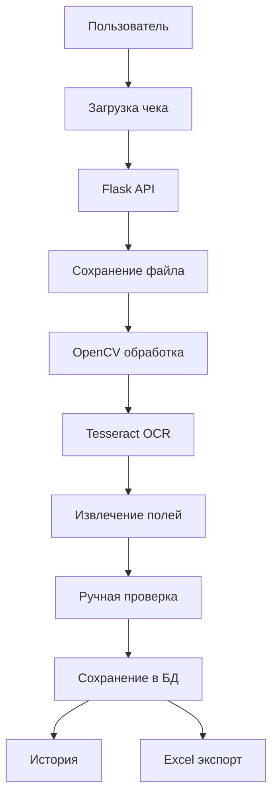
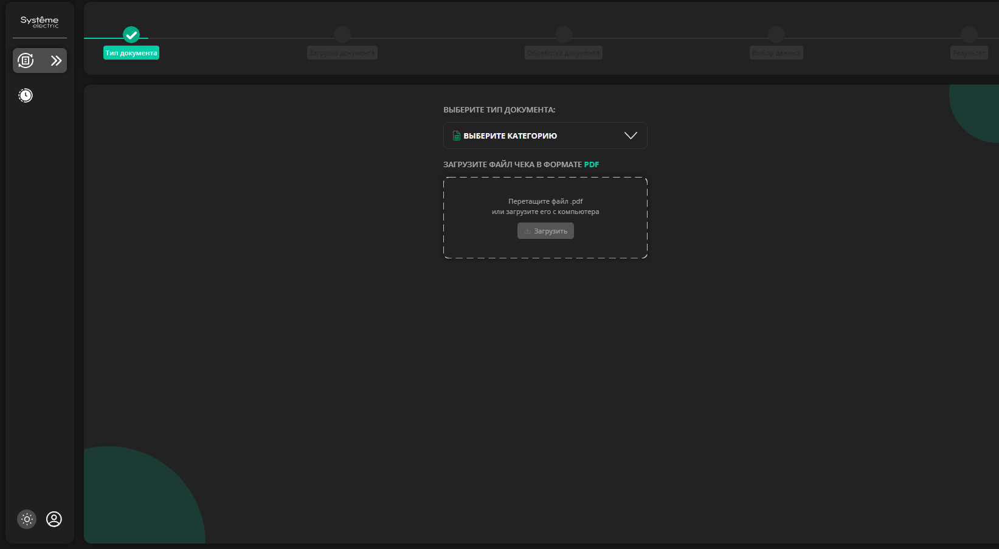
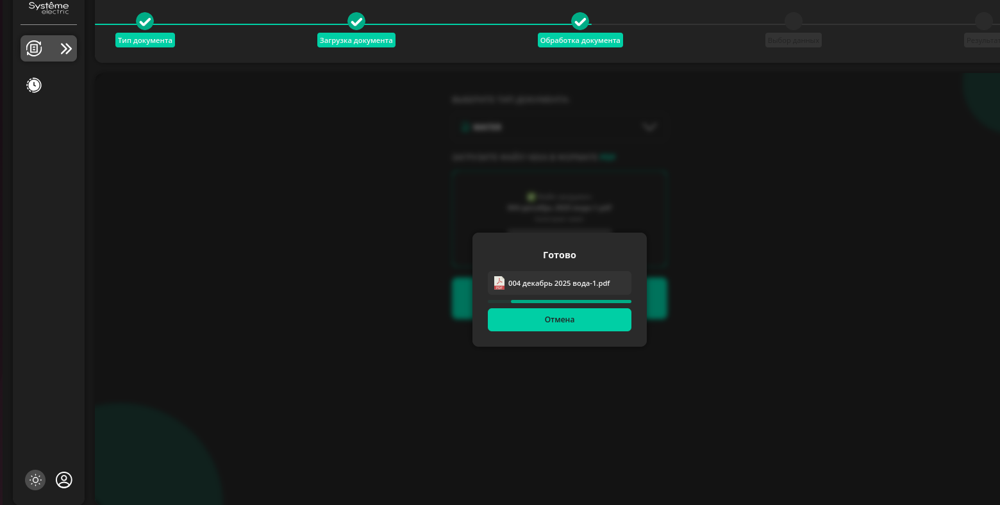
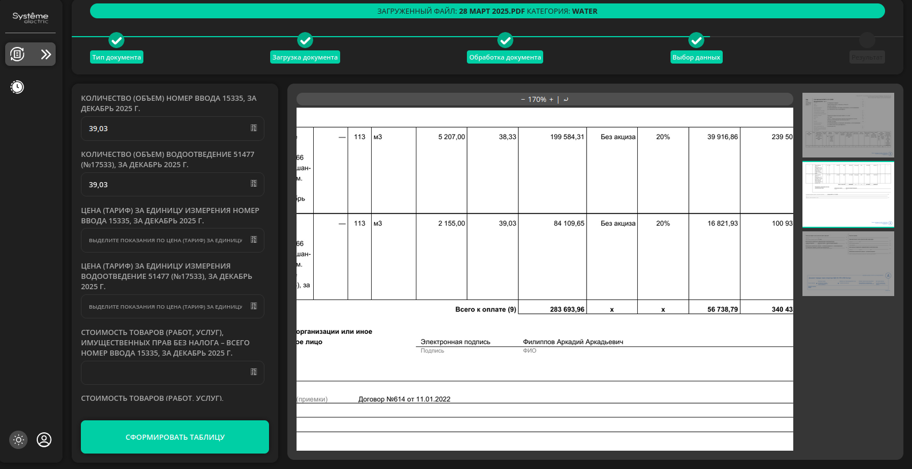
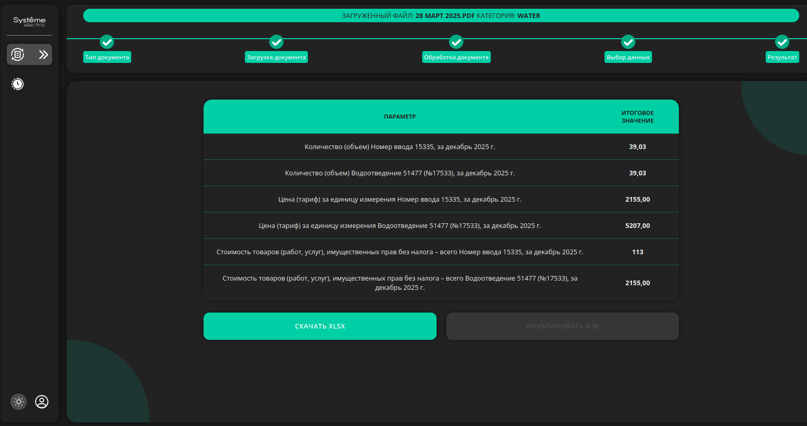
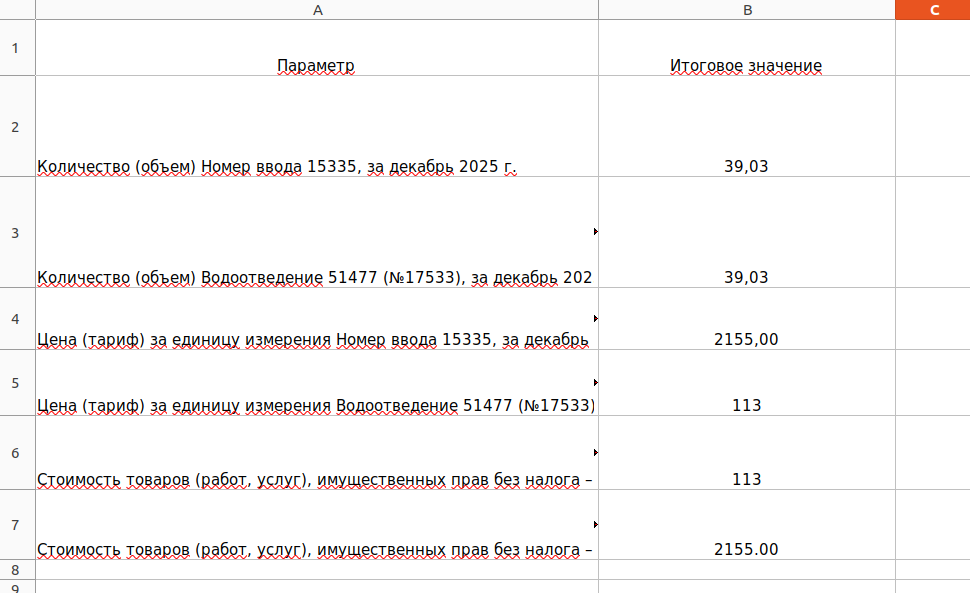

# Semi-Automatic Receipt Digitization

Проект для полуавтоматической оцифровки денежных чеков: загрузка изображения или файла чека, обработка изображения, OCR-распознавание, ручная проверка/уточнение извлечённых полей, сохранение истории и выгрузка данных в Excel.

---

## Содержание

- [О проекте](#о-проекте)
- [Возможности](#возможности)
- [Стек технологий](#стек-технологий)
- [Как это работает](#как-это-работает)
- [Скриншоты и схемы](#скриншоты-и-схемы)
- [Структура проекта](#структура-проекта)
- [API](#api)
- [Установка и запуск](#установка-и-запуск)
- [Настройка OCR](#настройка-ocr)
- [Работа с Excel](#работа-с-excel)
- [База данных](#база-данных)
- [Переменные окружения](#переменные-окружения)
- [Дальнейшее развитие](#дальнейшее-развитие)

---

## О проекте

Система предназначена для ускорения переноса данных из денежных чеков в структурированный цифровой формат. Пользователь загружает чек, приложение выполняет предварительную обработку изображения с помощью OpenCV, распознаёт текст через Tesseract OCR, после чего пользователь может проверить и при необходимости скорректировать найденные поля.

Основная идея проекта — не полностью автоматическая, а **полуавтоматическая** оцифровка: система помогает извлечь данные, но финальная проверка остаётся за пользователем.

---

## Возможности

- Загрузка файлов чеков через веб-интерфейс.
- Хранение загруженных файлов в директории `uploads`.
- Распознавание текста на изображениях чеков с помощью `pytesseract`.
- Предобработка изображений с помощью `OpenCV`.
- Получение списка типов документов.
- Проверка статуса обработки документа.
- Извлечение и уточнение отдельных полей.
- Сбор подтверждённых данных.
- Просмотр истории обработанных чеков.
- Экспорт данных в `.xlsx`.
- Раздача frontend-части через Flask.

---

## Стек технологий

### Backend

- Python
- Flask
- SQLAlchemy
- Pydantic
- OpenCV
- pytesseract
- Tesseract OCR

### Frontend

- HTML / CSS / JavaScript
- Статическая frontend-часть, отдаваемая Flask из директории `frontend`

### Данные и экспорт

- База данных через SQLAlchemy
- Excel-выгрузка в формате `.xlsx`

---

## Как это работает

Общий сценарий работы:

1. Пользователь открывает веб-интерфейс.
2. Загружает файл денежного чека.
3. Backend сохраняет файл в директорию `uploads`.
4. Изображение проходит предварительную обработку через OpenCV.
5. OCR-модуль распознаёт текст с помощью Tesseract.
6. Система пытается извлечь нужные поля: сумму, дату, номер чека, продавца и другие данные.
7. Пользователь проверяет результат и при необходимости исправляет поля.
8. Подтверждённые данные сохраняются в базу данных.
9. История обработок доступна через отдельный API.
10. Данные можно выгрузить в Excel.



---

## Скриншоты и схемы


### Главная страница



_Описание: экран загрузки денежного чека._

---

### Загрузка файла



_Описание: форма выбора и отправки файла на обработку._

---

### Выбор полей и оцифровка



_Описание: Пользователь выбирает поля._

---

### Ручная корректировка данных



_Описание: пользователь проверяет и исправляет распознанные поля._

---

### История обработанных чеков


_Описание: список ранее обработанных чеков._

---

### Excel-выгрузка



_Описание: выгрузка собранных данных в `.xlsx` файл._

---

## Структура проекта


```text
project/
├── main.py                 # Точка входа Flask-приложения
├── view.py                 # Бизнес-логика API-методов
├── models.py               # SQLAlchemy-модели
├── schemas.py              # Pydantic-схемы
├── database.py             # Подключение к базе данных
├── frontend/               # frontent
├── uploads/                # Загруженные чеки
├── media/                  # Парсинг
├── forms/                  # Шаблоны
├── xls/                    # Сгенерированные Excel-файлы
├── docs/
│   └── images/             # Скриншоты и схемы для README
├── requirements.txt
└── README.md
```


---

## API

Backend реализован на Flask. Ниже описаны маршруты, которые видны из `main.py`.

### Frontend

#### `GET /`

Отдаёт `frontend/index.html`.

#### `GET /<path:path>`

Отдаёт статические файлы из директории `frontend`. API-маршруты, загрузки и скачивания не перехватываются frontend-роутером.

---

### Загрузка файлов

#### `POST /api/upload`

Загружает файл чека на сервер.

**Тип запроса:** `multipart/form-data`

**Параметры:**

| Поле | Тип | Описание |
|---|---:|---|
| `file` | File | Файл чека для загрузки |
| другие поля формы | string | Дополнительные параметры, если используются во `view.upload_file` |

**Успешный ответ:** `201 Created`

```json
{
  "id": 1,
  "filename": "receipt.png",
  "message": "File uploaded successfully"
}
```

**Ошибки:**

- `400` — файл не передан или имя файла пустое.
- `500` — внутренняя ошибка сервера.

---

### Загруженные файлы

#### `GET /uploads/<filename>`

Возвращает загруженный файл из директории `uploads`.

---

### Скачивание файла

#### `GET /download/<filename>`

Скачивает файл из директории `uploads` как вложение.

**Ошибки:**

- `404` — файл не найден.

---

### Типы документов

#### `GET /api/document-types`

Возвращает список доступных типов документов.

**Успешный ответ:** `200 OK`

```json
[
  {
    "id": 1,
    "name": "Receipt"
  }
]
```

---

### Статус обработки

#### `GET /api/process/status`

Возвращает статус обработки документа или список доступных для проверки полей.

**Query-параметры:** зависят от реализации функции `process()` в `view.py`.

Пример:

```http
GET /api/process/status?id=1
```

**Успешный ответ:** `200 OK`

**Ошибки:**

- `400` — неверные параметры или ошибка обработки.

---

### Извлечение поля

#### `POST /api/extract-field`

Извлекает или уточняет конкретное поле на основе переданного JSON.

**Тип запроса:** `application/json`

Пример запроса:

```json
{
  "document_id": 1,
  "field_name": "total",
  "value": "12.50"
}
```

**Успешный ответ:** `200 OK`

```json
{
  "document_id": 1,
  "field_name": "total",
  "value": "12.50"
}
```

**Ошибки:**

- `400` — пустой или некорректный JSON.

---

### Сбор подтверждённых данных

#### `POST /api/collect`

Сохраняет подтверждённые данные после проверки пользователем.

**Тип запроса:** `application/json`

Пример запроса:

```json
{
  "document_id": 1,
  "fields": {
    "date": "2026-05-12",
    "total": "12.50",
    "seller": "Example Store"
  }
}
```

**Успешный ответ:** зависит от реализации функции `collect()`.

**Ошибки:**

- `400` — ошибка сохранения или некорректные данные.

---

### История

#### `GET /api/history`

Возвращает историю обработанных чеков.

**Успешный ответ:** `200 OK`

```json
[
  {
    "id": 1,
    "filename": "receipt.png",
    "created_at": "2026-05-12T12:00:00",
    "status": "processed"
  }
]
```

---

### Excel-экспорт

#### `GET /api/excel`

Генерирует или возвращает Excel-файл из директории `xls`.

**Query-параметры:** зависят от реализации функции `excel()` в `view.py`.

Пример:

```http
GET /api/excel?id=1
```

**Ответ:** `.xlsx` файл для скачивания.

**Ошибки:**

- `400` — ошибка генерации или чтения Excel-файла.

---

## Установка и запуск

### 1. Клонирование репозитория

```bash
git clone <repository-url>
cd <project-folder>
```

### 2. Создание виртуального окружения

```bash
python -m venv .venv
```

Активация окружения:

#### Windows

```bash
.venv\Scripts\activate
```

#### Linux / macOS

```bash
source .venv/bin/activate
```

### 3. Установка зависимостей

```bash
pip install -r requirements.txt
```

Если файла `requirements.txt` ещё нет, его можно создать командой:

```bash
pip freeze > requirements.txt
```

Минимальный пример зависимостей:

```text
annotated-types==0.7.0
blinker==1.9.0
click==8.3.1
Flask==3.1.2
Flask-Pydantic==0.13.2
Flask-SQLAlchemy==3.1.1
greenlet==3.3.0
itsdangerous==2.2.0
Jinja2==3.1.6
MarkupSafe==3.0.3
pydantic==2.12.5
pydantic_core==2.41.5
SQLAlchemy==2.0.44
typing-inspection==0.4.2
typing_extensions==4.15.0
Werkzeug==3.1.4

```

### 4. Установка Tesseract OCR

#### Windows

1. Установите Tesseract OCR.
2. Добавьте путь к `tesseract.exe` в `PATH`.
3. При необходимости явно укажите путь в коде:

```python
import pytesseract

pytesseract.pytesseract.tesseract_cmd = r"C:\Program Files\Tesseract-OCR\tesseract.exe"
```

#### Linux

```bash
sudo apt update
sudo apt install tesseract-ocr
```

Для русского языка:

```bash
sudo apt install tesseract-ocr-rus
```

#### macOS

```bash
brew install tesseract
```

### 5. Создание нужных директорий

Приложение автоматически создаёт директорию `uploads`, но при необходимости можно создать папки вручную:

```bash
mkdir uploads
mkdir xls
mkdir -p docs/images
```

### 6. Запуск приложения

```bash
python main.py
```

По умолчанию Flask запустится в debug-режиме.

Откройте в браузере:

```text
http://127.0.0.1:5000
```

---

## Настройка OCR

Для работы OCR используется связка:

- `OpenCV` — подготовка изображения;
- `pytesseract` — Python-обёртка;
- `Tesseract OCR` — движок распознавания текста.

1. Чтение изображения.
2. Перевод в оттенки серого.
3. Удаление шума.
4. Бинаризацию.
5. Выравнивание или обрезку изображения.
6. OCR-распознавание.
7. Постобработку текста регулярными выражениями или правилами.


## Работа с Excel

Экспорт выполняется через маршрут:

```http
GET /api/excel
```

Сгенерированные файлы сохраняются в директории:

```text
xls/
```

Файл отправляется пользователю через `send_file()` как вложение с расширением `.xlsx`.

---

## База данных

В `main.py` база данных подключается через:

```python
from database import SessionLocal, engine
import models
```

При запуске приложения создаются таблицы:

```python
models.Base.metadata.create_all(bind=engine)
```

Сессия базы данных создаётся на время запроса и закрывается после завершения контекста Flask:

```python
def get_db():
    if "db" not in g:
        g.db = SessionLocal()
    return g.db
```

---
